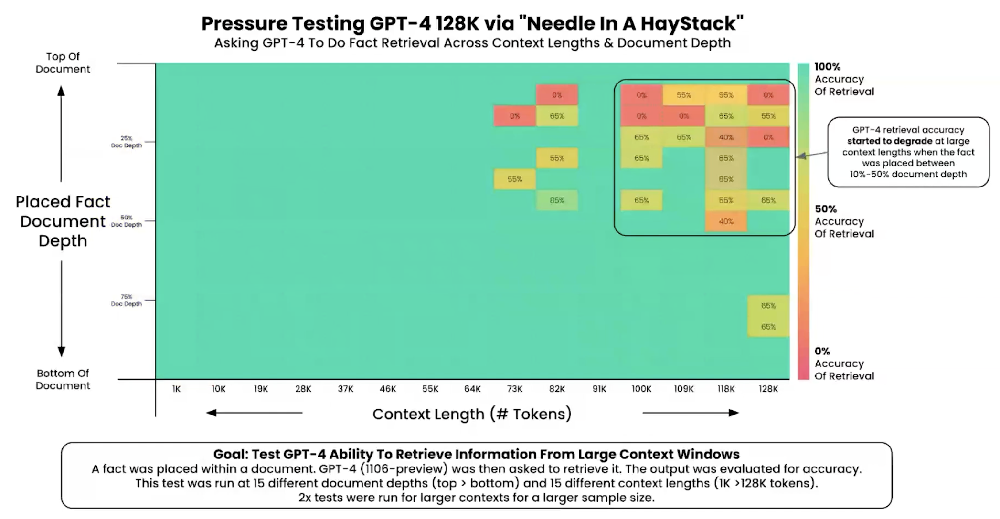

# 生成AIメモリ技術入門：基礎から最新のAgentic Memoryまで

## 第1章：生成AIメモリのパラダイムシフト

### 1.1 メモリの定義と分類
大規模言語モデル（LLM）の基盤をなすTransformerアーキテクチャは、本質的にステートレス（状態を持たない）なシステムとして設計されている。入力されたプロンプトに対して確率的に次のトークンを予測する関数に過ぎず、モデル自体が過去の対話履歴やユーザー固有の文脈を自律的に保持することはない。この構造的制約を克服し、人工知能に連続性と文脈理解をもたらすための技術群が、生成AIにおける「メモリ技術」である。

学術的および認知心理学的な観点から、AIのメモリシステムは人間の記憶モデルのアナロジーを用いて分類されることが多い[^1]。人間の記憶が感覚記憶、短期記憶、長期記憶に分かれるように、AIシステムにおいても情報を保持する期間とメカニズムに基づく厳密な分類が存在する[^3]。LLMメモリの分類や人間との記憶モデルの比較に関する包括的な学術的サーベイとしては、『From Human Memory to AI Memory: A Survey on Memory Mechanisms in the Era of LLMs』(arXiv:2504.15965) が非常に詳細な見取り図を提供している[^5]。

第一に、コンテキストウィンドウ内に保持される情報を「短期記憶（Short-term Memory）」または「ワーキングメモリ」と定義する。これは現在のセッションやタスクの実行中にのみ有効な活性化された情報であり、In-context Learning（文脈内学習）の基盤となる[^4]。モデルはファインチューニングを伴わずとも、この短期記憶内に提示されたプロンプトの指示や少数の例示（Few-shot）から動的にパターンを学習し、出力を適応させることができる[^4]。

第二に、セッションをまたいで永続化される情報を「長期記憶（Long-term Memory）」と定義する[^4]。これにはさらに二つの形態が存在する。モデルの重みパラメータ自体に焼き込まれた知識である「パラメトリックメモリ（Parametric Memory）」と、ベクトルデータベースやナレッジグラフなどの外部ストレージに保存される「非パラメトリックメモリ（External Memory）」である[^2]。現代の高度なAIエージェント設計においては、膨大な情報を外部ストレージに長期記憶として保持し、現在のタスクに関連する情報のみを動的に検索（Retrieve）して短期記憶（コンテキストウィンドウ）に注入するハイブリッドアーキテクチャが主流となっている[^4]。また、対象次元の観点から、システム全体の知識を司る「システムメモリ」と、特定のユーザーの嗜好や履歴を追跡する「パーソナルメモリ（エピソード記憶）」という分類も、パーソナライズされたAIの文脈では重要視されている[^2]。

---

### 1.2 ステートレスなLLMにおける課題と評価指標
LLMのステートレスな性質は、実運用において「AIの健忘症（AI Amnesia）」と揶揄される致命的な課題を引き起こす[^9]。長期間にわたる対話や、数日をまたぐ複雑なタスクの実行において、以前提供した前提条件や指示をモデルが忘却してしまうことは、AIを単なる一問一答のツールから真の協働パートナー（Copilot）へと昇華させる上での最大のボトルネックとなる[^11]。

この課題を解決するためのメモリシステムを設計・評価する際、システムは以下の主要な評価指標の複雑なトレードオフを管理しなければならない[^9]。

| 評価指標                                  | 概要とシステムへの影響                                                                                                                                           |
| :---------------------------------------- | :--------------------------------------------------------------------------------------------------------------------------------------------------------------- |
| **精度 (Accuracy / Retrieval Quality)**   | 必要な情報を外部メモリから正確に検索し、ハルシネーション（幻覚）を排除して回答を生成できる能力。検索ノイズが混入すると、後段の推論が致命的なエラーを引き起こす。 |
| **レイテンシ (Latency)**                  | 外部ストレージからの情報検索や、長文脈の処理にかかる推論遅延。リアルタイムの対話型エージェントや音声アシスタントにおいては、UXを決定づける最重要指標となる。     |
| **コスト (Cost)**                         | LLMのAPI利用料や計算資源は処理トークン数に比例する。メモリとしてプロンプトに含める情報量（コンテキストサイズ）の無秩序な増加は、指数関数的なコスト増大を招く。   |
| **情報の鮮度 (Freshness / Updatability)** | ユーザーの状況や外部環境が変化した際、古い記憶をいかに検知して破棄・上書きするかという状態管理能力。矛盾する古い情報が残存すると、モデルの推論が破綻する。       |

これらの指標をいかに最適化し、長期間にわたる首尾一貫性（Long-term coherence）を維持するかが、現在の生成AI研究における中心的な命題となっている。

---

## 第2章：コンテキストウィンドウの進化

### 2.1 Transformerの限界と最新のアプローチ
生成AIの短期記憶の容量は、モデルが一度に処理できるトークン数（コンテキストウィンドウ）に完全に依存する。しかし、標準的なTransformerアーキテクチャにおける中核的なメカニズムであるSelf-Attention（自己注意機構）は、系列長（$N$）に対して計算量およびメモリ消費量が$O(N^2)$で二次関数的に増加するという数学的な限界を抱えている[^15]。この制約により、単純なハードウェアのスケールアップのみで長文脈を処理しようとすると、メモリ枯渇（OOM: Out of Memory）を招き、数万トークン以上の入力を扱うことは長らく困難とされてきた[^16]。

このアーキテクチャ上の制約を打破し、コンテキストウィンドウの長さを飛躍的に拡張するための最新のアプローチが **Blockwise Parallel Transformers（BPT）** および **Ring Attention** である。

BPTは、入力系列をブロック単位に分割し、Attention行列の全体を実体化（Materialization）することなく、ネストされたループ処理によってブロックごとにAttentionとFeed-Forward演算を行う手法である[^15]。これによりメモリのオーバーヘッドは層あたり $$2bsh$$ バイト（$b$:バッチサイズ, $s$:系列長, $h$:隠れ層の次元数）へと大幅に削減されるが、デバイス間でのデータ通信がボトルネックとなる課題が残されていた[^15]。

これを解決したのがカリフォルニア大学バークレー校などの研究チームによって提案された「Ring Attention」である[^16]。このアーキテクチャでは、複数のGPUやTPUホストを論理的なリング構造として配置する。各デバイスが自ブロックのQueryに対する計算（Outer loop）を行いながら、同時に隣接するデバイスへKey-Valueブロックの通信（オーバーラップ通信）を行う[^15]。この計算と通信の並列化により、個々のデバイスのメモリ制約を完全に排除し、クラスタ内のデバイス数に比例してコンテキスト長を線形にスケールさせることが可能となった[^16]。実験によれば、TPUv4-512のセットアップにおいて1億トークンを超える「ニア・インフィニット（ほぼ無限）」の文脈サイズでの学習と推論が実証されている[^19]。

---

### 2.2 「Long-context LLM」 vs 「RAG」の公正な比較
数十万から数百万トークンをネイティブに処理できるGemini 1.5 ProやClaude 3.5 Sonnetのような「Long-context LLM」の登場により、業界内では「外部検索を用いるRAGは不要になるのではないか」という議論が巻き起こった。しかし、2025年時点の実運用における公正な学術的・実務的比較において、両者は競合するものではなく、明確な補完関係にあることが証明されている[^20]。

**数百万トークン時代におけるRAGの存在意義** Long-context LLMに大量のドキュメントを直接入力（プロンプト・スタッフィング）するアプローチは、情報の事前加工が不要であり、すべてのコンテキストを網羅できるという利点がある。しかし、計算リソースの消費が極めて激しく、RAGと比較してクエリあたりの推論コストが数桁高くなるという致命的な欠点を持つ[^20]。Elasticsearch Labs等の研究では、長文脈への直接入力に比べ、RAGシステムはクエリあたりのコストを最大1250分の1に抑えられることが示されている[^21]。さらに、初回推論時のTime-To-First-Token（最初のトークンが出力されるまでの遅延）が著しく増加するため、リアルタイム性が求められるアプリケーションには不向きである[^20]。対してRAGは、関連するチャンクのみを抽出してモデルに渡すため、トークン消費を抑え、推論コストとレイテンシを劇的に削減するとともに、情報源のトレーサビリティ（グラウンディング）を担保しやすいという明確な存在意義を維持している[^21]。

**評価指標としての「Needle In A Haystack」テスト** LLMの長文脈処理能力を測るデファクトスタンダードの評価指標として、Greg Kamradt氏によって提唱された「Needle In A Haystack（干し草の山から針を探す：NIAH）」テストがある[^25]。このテストの実行スクリプトや様々なモデルの検証手法については、氏の[GitHub](https://github.com/gkamradt/LLMTest_NeedleInAHaystack)にて詳しく解説されている[^28]。これは、数万から数百万トークンにおよぶ無関係な長文（干し草）の様々な深さ（位置）に、特定の事実（針）を挿入し、モデルがその事実を正確に抽出できるかを測定し、ヒートマップとして可視化する手法である[^26]。

| NIAHテストから判明した長文脈LLMの特性と限界                                                                                                                                                                               |
| :------------------------------------------------------------------------------------------------------------------------------------------------------------------------------------------------------------------------ |
| **U字型の性能劣化（Lost in the Middle）**：モデルは文脈の「先頭」と「末尾」の情報を高い精度で抽出できるが、文脈の「中間（7%〜50%の深さ）」に埋もれた情報を無視・忘却する強い傾向がある[^28]。                             |
| **単一事実 vs 複数事実の乖離**：単一の「針」の検索精度が95%を誇るモデルであっても、複数の事実を同時に抽出・統合して推論する「Multi-Needle」タスクにおいては、精度が60%台まで急落する[^26]。                               |
| **文脈長と精度の反比例**：モデルの最大コンテキスト長（例：128Kや200K）に近づくにつれて、検索の確実性は保証されなくなり、入力するコンテキスト量が少ないほど回答の正確性が向上するという普遍的な原則が確認されている[^28]。 |

NIAHテストの結果は、たとえモデルが数百万トークンを処理できるスペックを誇っていても、必要な情報を確実に取り出せるわけではないことを示している。したがって、長文脈モデルのポテンシャルを最大限に引き出すためにも、不要なノイズを事前に排除するRAGや高度なメモリ管理技術が不可欠である[^26]。

---

## 第3章：基礎的な対話履歴の管理

### 3.1 プロンプトへの状態（State）の埋め込み
対話型AIアプリケーションにおいて最も基礎的なメモリ管理手法は、過去の対話履歴をシステム側で構造化し、毎回の推論時にLLMのプロンプト（コンテキストウィンドウ）に「状態（State）」として動的に注入することである。しかし、対話が長引くにつれて履歴は肥大化するため、以下の3つの主要なアプローチ間でトレードオフの選択を迫られる[^30]。

1.  **全履歴保持（Full History）**: コンテキストウィンドウの上限に達するまで、過去のやり取りを一言一句違わず保持し続ける。情報の忠実度とコンテキストの豊かさは最大となるが、トークン消費コストがAPIコールのたびに線形増加し、レイテンシも悪化する[^30]。
2.  **スライディングウィンドウ（Sliding Window）**: 直近の $K$ 回（例：過去10回のターン）のやり取りのみを保持し、古い履歴を順次切り捨てていく。実装が極めて容易でありトークンコストも一定に保てるが、セッション初期にユーザーが提供した重要な前提条件やペルソナの指示が「ウィンドウ外」に押し出された瞬間にモデルが忘却してしまうという致命的な弱点を持つ[^31]。
3.  **要約（Summary）**: 過去の履歴全体、あるいはスライディングウィンドウから溢れた古い履歴を、LLM自身に要約させて圧縮した状態として保持する手法である。長期間の文脈を低コストで維持できるが、要約プロセスの過程で細かなニュアンス、具体的な固有名詞、あるいは将来重要になるかもしれない潜在的な事実が不可逆的に欠落するリスクを伴う[^30]。

---

### 3.2 実装の落とし穴：コンテキストの希釈化（Context Dilution）

履歴や検索結果を単純にプロンプトに詰め込む実装において、開発者が陥りやすい最大の落とし穴が「Context Dilution（コンテキストの希釈化）」である。この現象のメカニズムや、後述する「Lost in the Middle」問題を図解付きで学ぶには、[diffray.aiのブログ](https://diffray.ai/blog/context-dilution/)が直感的な理解の助けとなる[^29]。これは、プロンプト内に詰め込まれた情報量やノイズが多くなるほど、LLMのAttention（注意機構）が分散し、真に重要な情報への焦点がぼやけ、タスクの実行精度が劇的に低下する現象を指す[^29]。

#### 3.2.1 根本原因：Attention Sinksとゼロサムの注意配分

この現象の根本原因は、Transformerアーキテクチャに内在する「Attention Sinks（注意の掃き溜め）」と呼ばれる仕様にある[^29]。Self-AttentionにおけるSoftmax正規化の数学的特性上、Attentionの重みの合計は必ず1にならなければならない。これはゼロサムの構造を意味し、トークンが追加されるたびに、既存のすべてのトークンに割り当てられるAttentionの総量が減少する[^29]。入力中に高い意味的関連性を持つトークンが存在しない場合、モデルは残余のAttentionスコアを、入力の先頭にある特段重要ではないトークン（システムプロンプトの冒頭部分、改行記号、区切り文字など）に強制的に「投棄」する[^29]。つまり、無関係なドキュメントを1件追加するごとに、関連する情報から注意が単調に奪われ（monotonically increases noise）、シグナルの品質が累積的に劣化していく[^29]。

#### 3.2.2 定量的エビデンス：「正解が見えているのに答えられない」

Stanford大学、Anthropic、Meta AIなどの共同研究論文『Lost in the Middle: How Language Models Use Long Contexts』は、この現象を体系的に実証した先駆的研究である[^29_2]。

**Multi-Document QAタスクの実験結果** では、正解を含むドキュメントをコンテキスト内の様々な位置に配置し、モデルの回答精度を測定した。その結果、以下の事実が明らかになった[^29_2]。

- **GPT-3.5-Turbo** は、正解ドキュメントがコンテキストの先頭または末尾に配置された場合に最高精度を示したが、20件のドキュメントのうち中間位置に配置された場合、精度は **52.9%** にまで急落した。さらに30件のドキュメント設定では **49.5%** まで低下し、これは**ドキュメントを一切与えない「閉本テスト（Closed-book）」の精度56.1%をも下回る**という驚くべき結果であった[^29_2]。すなわち、正解を含む文脈を与えたことが、むしろモデルの性能を悪化させたのである。
- この「U字型の性能劣化」パターンは、Claude-1.3（Closed-book: 48.3%）、MPT-30B-Instruct（Closed-book: 31.5%）、LongChat-13B（Closed-book: 35.0%）など、テストされたすべてのモデルで普遍的に観測された[^29_2]。
- オラクル設定（正解ドキュメント1件のみを与えた場合）では、GPT-3.5-Turboは88.3%の精度を発揮した。しかし、同一の正解ドキュメントを19件の無関係なドキュメントの中に埋めた途端、**35ポイント以上の精度劣化**が発生した[^29_2]。

この結果は、コンテキストの拡大が「情報の追加」ではなく「ノイズの追加」として作用し、モデルの推論能力を積極的に破壊しうることを定量的に証明している。

#### 3.2.3 「公称値」と「実効値」の乖離：RULERベンチマーク

モデルが「128Kトークン対応」と公称していても、それが実際に使い物になるかは全く別の問題である。NVIDIAが2024年に発表したRULERベンチマークは、単純なNIAHテストを超えた複合タスク（マルチホップ推論、集約、複数事実の検索など）で各モデルの「実効コンテキスト長」を測定し、公称値との深刻な乖離を明らかにした[^29_3]。

| モデル       | 公称コンテキスト長 | 実効コンテキスト長 | 性能劣化幅       |
| :----------- | :----------------- | :----------------- | :--------------- |
| GPT-4        | 128K               | 64K                | **15.4ポイント** |
| Yi-34B       | 200K               | 32K                | **16.0ポイント** |
| Mistral 7B   | 32K                | 16K                | **79.8ポイント** |
| Mixtral 8x7B | 32K                | 32K                | **50.4ポイント** |

さらに、Adobe Researchが2025年2月に発表したNoLiMaベンチマークでは、テストした12モデル中11モデルが **32Kトークン時点でベースライン性能の50%以下** にまで劣化した。GPT-4oですら、4Kトークン時の99.3%から32K時の69.7%へと大幅に精度が低下している[^29]。

これらの結果は、開発者に対して「モデルの公称コンテキスト長を鵜呑みにしてはならない」という明確な警告を発している。実効的に信頼できる範囲は、多くのモデルで公称値の半分以下であり、この限界を超えた領域に情報を配置することは、Context Dilutionのリスクを飛躍的に高める。

#### 3.2.4 マルチホップ推論における増幅効果

Context Dilutionの影響は、単一事実の検索よりも**マルチホップ推論**（複数の事実を連鎖的に結びつけて回答を導出するタスク）において壊滅的に増幅される。Lahmy & Yozevitchの論文『Replace, Don't Expand』は、RAGシステムにおいて初回の検索でブリッジファクト（推論の橋渡しとなる事実）を取りこぼした場合、追加検索によってコンテキストを「拡張」するアプローチが逆効果となることを実証した[^34]。

2WikiMultiHopQAベンチマーク（検索深度 $k=5$）において、コンテキストを拡張する手法であるCRAGは、検索されたドキュメントの適合率（Precision）が **22%にまで崩壊** した[^34]。これは、$k=3$ 時点の30〜60%からの壊滅的な劣化であり、追加された大量のディストラクタ（妨害情報）が関連情報を圧倒した結果である[^34]。一方、コンテキストサイズを固定したまま低品質なドキュメントを高品質なものに「置換」する戦略（SEAL-RAG）は、同条件で **96%の適合率と68〜74%の回答精度** を維持した[^34]。

この研究は、Context Dilutionへの対処として「拡張（Expand）」ではなく「置換（Replace）」が原則であることを示唆しており、メモリシステム設計の根本的な指針となる。

#### 3.2.5 設計原則：コンテキストの「純度」を最大化せよ

以上のエビデンスから導かれる設計原則は明確である。コンテキストを拡張するのではなく、いかにノイズを削ぎ落とし、**純度の高いシグナルのみ** をプロンプトに組み込むかが、優れたメモリシステム設計の要諦である[^34]。具体的な緩和策として、以下のアプローチが有効性を実証している[^29]。

- **プロンプト圧縮**: Microsoft ResearchのLLMLinguaは、最大20倍の圧縮を施しつつ推論性能の低下をわずか1.5ポイントに抑え、推論速度を1.7〜5.7倍に高速化する[^29]。
- **文脈付きチャンク検索**: Anthropicの「Contextual Retrieval」研究では、各チャンクに50〜100トークンの文脈説明を付与するだけで、検索失敗率を5.7%から2.9%へと49%削減し、リランキングとの併用で67%削減（1.9%）を達成した[^29]。
- **明示的推論ステップの強制**: 検索された証拠を回答前に「復唱」させるプロンプト技法により、RULERベンチマーク上でGPT-4oの性能が4ポイント改善した[^29]。
- **実効ウィンドウ内への収容**: マルチエージェントアーキテクチャにおいて、各エージェントに専門領域に特化した25Kトークン以内のコンテキストのみを配分することで、性能劣化域を回避しつつ網羅的な分析を実現する[^29]。

---

## 第4章：高度な検索拡張生成（Advanced RAG & GraphRAG）

### 4.1 単純なベクトル検索（Naive RAG）の限界
外部ストレージを用いた長期メモリとして最も普及しているのが、ドキュメントを一定のサイズで分割し、埋め込みベクトル化して類似度検索を行う「Naive RAG（単純なRAG）」である。しかし、この手法は「チャンクサイズのジレンマ」と「文脈の喪失」という構造的欠陥を抱えている[^36]。

一般的な実装では、LangChainなどのツールを用いて「512トークン、50トークンオーバーラップ」といった固定サイズでのテキスト分割（Recursive Character Splittingなど）が行われる[^36]。しかし、この機械的な分割は、段落や文の途中で意味的な塊を分断し、「コンテキストの孤児（Contextual orphans）」を生み出してしまう[^36]。その結果、代名詞の指示対象がチャンク外に存在して意味が破綻したり、構造化された表データが破壊されたりすることで、ベクトル検索時のセマンティックシグナルが著しく希釈化し、LLMに無意味な断片を提供してしまう原因となる[^36]。

---

### 4.2 最新のRAGアプローチ
Naive RAGの限界を克服するため、現在のエンタープライズ実装では以下の高度なアプローチが標準化している。

| 手法                                               | 概要と利点                                                                                                       | トレードオフ                                                   |
| :------------------------------------------------- | :--------------------------------------------------------------------------------------------------------------- | :------------------------------------------------------------- |
| **セマンティックチャンキング** (Semantic Chunking) | 固定文字数ではなく、意味的な変化点を検知し、意味的な整合性を保ったまま分割する手法[^36]。再現率が向上する[^42]。 | 前処理のコストと時間が指数関数的に増大する[^36]。              |
| **ハイブリッド検索**                               | 意味検索とキーワード一致（BM25）を組み合わせた検索[^42]。メタデータによる絞り込みでノイズを削減する[^42]。       | メタデータの設計と維持管理の複雑さが運用オーバーヘッドとなる。 |

※特定の条件下においては依然として512トークンのRecursive Character Splittingが、計算効率と精度のバランス（Accuracy 69%）で最も堅牢なデフォルトであるという結果も報告されており、ユースケースに応じた適切な使い分けが求められる[^39]。
当該参照先はチャンキングの議論として勉強になるもので面白い。

---

### 4.3 GraphRAGによる構造化メモリ
ベクトル検索の根本的な弱点は、「情報同士の関係性（Relationship）」を空間的な距離でしか表現できず、論理的な繋がりを理解できない点にある[^46]。

これを解決するパラダイムシフトとしてMicrosoft Researchが提唱したのが **GraphRAG** である[^49]。詳細なメカニズムについては、Microsoftの[公式ブログ](https://www.microsoft.com/en-us/research/blog/graphrag-unlocking-llm-discovery-on-narrative-private-data/)および論文『From Local to Global: A Graph RAG Approach to Query-Focused Summarization』(arXiv:2404.16130)を参照されたい[^51]。GraphRAGは、生テキストからLLMを用いてエンティティとそれらの関係性を抽出し、構造化されたナレッジグラフを構築するアーキテクチャである[^46]。

#### LeidenアルゴリズムとCommunity Summarization

MicrosoftのGraphRAGの中核をなすのが、Leidenアルゴリズムを用いた階層的なコミュニティ検出である[^46]。このアルゴリズムは、構築されたグラフの中で密に結合したノード群を抽出し、階層化を行う[^46]。その後、LLMがコミュニティ全体の要約を事前生成する[^49]。これにより、データセット全体を網羅的に解釈する必要がある「グローバル検索（Global Search）」において、従来のRAGを圧倒する回答の網羅性と多様性を発揮する[^49]。

#### 構築コストの課題と軽量化へのアプローチ

しかし、GraphRAGには「インデックス構築時のLLMトークン消費量が莫大である」という明確な課題が存在する[^24]。100万トークン規模のコーパス処理に数十万の追加APIコストが発生するケースがある[^24]。このスケーラビリティの課題に対し、2025年現在、複数の最適化手法が提案されている。例えば、LLMの事前抽出をスキップする「GraphRAG-V」[^56]や、必要なグラフのみを動的に探索する「LazyGraphRAG」[^46]、あるいは $k$-core分解を利用して階層構造を構築するアプローチ[^58]など、コストと精度を両立させるためのアーキテクチャ進化が急速に進んでいる。

---

## 第5章：エージェントメモリとCRUD管理（最重要）

### 5.1 AIにおけるメモリのCRUD（作成・読み取り・更新・削除）
RAGやGraphRAGが「外部に存在するドキュメント群」を対象とするのに対し、**Agentic Memory（エージェントメモリ）**は、AIが自律的に「ユーザーとの対話履歴や過去の実行経験から学習し、状態を管理する」ことに焦点を当てる[^30]。ここでの中核的な概念は、記憶に対するCRUD（Create, Read, Update, Delete）操作をLLMエージェント自身がツールを用いて自律的に制御することである[^30]。

長期稼働するエージェントにおいて、メモリの品質が時間の経過とともに劣化していく現象は **「Memory Drift（メモリドリフト）」** と呼ばれる[^66]。要約の要約を繰り返すことで低頻度の詳細が静かに失われる「Summarization Drift」、矛盾する情報の蓄積による推論の破綻、そして単純なログの肥大化によるコンテキストの汚染が、その主要な原因である[^66]。このメモリドリフトに対処するために、以下の3つの中核戦略が提唱されている[^66]。

#### 戦略1：Conflict Merging（競合解消）

自律的なメモリ管理において最も難易度が高いのが「情報の更新」と「矛盾の解消」である[^65]。例えば、ユーザーが過去に「私は犬が好きだ」と発言し記憶された後、数週間後に「実は犬アレルギーであることが判明した」と発言した場合、単純な追記のみを行うと、推論が破綻してしまう。この問題を解決するためのConflict Merging戦略として、主に以下の手法が実装される[^66]。

* **セマンティックマージ**: 既存の記憶と新たに抽出された事実を照合し、「重複」「矛盾」「詳細化」を判定する[^66]。新しい蒸留候補と既存の類似記憶を比較し、意味的に等価であるかをバイナリ判定（yes/no）することで、既存記憶へのマージか新規記憶の作成かを決定する[^66]。
* **Bi-temporal modeling（双時間モデリング）**: 各事実に「有効開始日」と「記録日」の2つのタイムスタンプを付与し、最新の情報を「現在の真実」として優先的に取得する[^66]。これにより、過去のある時点における真実も遡及的に参照可能となり、単純な上書きでは失われる履歴的文脈を保持できる[^67]。
* **調停エージェント（Arbitration Agent）**: 相反する情報がもたらされた際、その文脈や信頼性を評価して決定を下す専門エージェントを配置する[^66]。単純なタイムスタンプベースの解決では不十分な場合に、イベントソーシングによって各書き込みの背後にある推論過程を記録し、異なる解決戦略でメモリ形成をリプレイすることも可能にする[^66]。

#### 戦略2：Batched Distillation（バッチ蒸留）

生のインタラクションログをそのまま記憶として蓄積するのではなく、一定のバッチ単位でLLMに「蒸留（Distillation）」させ、構造化されたコンパクトな記憶オブジェクトへと変換する戦略である[^66]。ここで重要なのは、「蒸留」は単なる「要約」とは根本的に異なるアプローチであるという点である[^66_2]。要約が無関係な素材も含めて全体を縮約するのに対し、蒸留は「何が達成されたか（narrative）」と「確立された事実のリスト」という構造化された抽出物（distillate）を生成する[^66_2]。

具体的な実装としては、各対話交換を以下のような複合オブジェクトに変換する手法が研究されている[^66_3]。

* **exchange_core**: 何が達成されたかの1〜2文の要約
* **specific_context**: 区別に資する技術的詳細1件
* **room_assignments**: 1〜3個のテーマ別分類タグ
* **files_touched**: 正規表現で抽出されたファイルパス

この手法により、平均371トークンの生の対話が平均38トークンへと **約11倍に圧縮** されつつも、ベクトル検索における検索品質（MRR）は元の **96%を維持** することが実証されている[^66_3]。ただし、BM25等のキーワード検索においては高IDF語彙の27%しか保存されないため有意な劣化が生じる点に留意が必要であり、ベクトル検索とキーワード検索を組み合わせたクロスレイヤー検索によって、純粋な原文ベースラインをわずかに上回る検索精度（MRR 0.759）を達成できることが報告されている[^66_3]。

#### 戦略3：Periodic Summarization（定期的要約・エピソード記憶の統合）

エージェントの対話履歴を一定のインターバルで定期的に圧縮し、学習内容を蒸留しつつ冗長なコンテキストを刈り込む **Episodic Memory Consolidation（EMC：エピソード記憶統合）** である[^66_4]。具体的な実装では、要約エージェントが50ターンごとに過去100回のインタラクションをレビューし、重要なパターンや教訓を抽出・統合する[^66_4]。

この戦略の核心は、コンテキストウィンドウが再び満杯になった際に、蒸留済みの記憶をさらに高次の要約（メタ蒸留）へと統合できる階層的な圧縮構造にある[^66]。これにより、5.2節で述べるMemGPTのOS型アーキテクチャと同様に、限られたワーキングメモリで仮想的に無限の履歴を扱えるようになる。

#### 3戦略の統合効果

これら3つの戦略は競合するものではなく、相補的に機能する。マルチエージェントシステムにおけるドリフト削減の実験では、EMC単体で **51.9%**、単体で最も効果の高いAdaptive Behavioral Anchoring（ABA）で **70.4%** のドリフト削減が得られたのに対し、3戦略を統合した場合は **81.5%のドリフト削減** を達成した[^66_4]。ただし、統合実装は計算オーバーヘッドが **23%増加** し、タスク完了時間の中央値が **9%延伸** するトレードオフが報告されており、ミッションクリティカルなアプリケーションでは許容範囲だが、高スループットシステムでは選択的な適用が求められる[^66_4]。

---

### 5.2 メモリの階層化アーキテクチャ（OSのメモリ管理とのアナロジー）
高度な自律型エージェントのメモリシステムは、コンピュータのOSにおける仮想メモリ管理から着想を得て設計されている。代表的な研究が、カリフォルニア大学バークレー校らによる論文『MemGPT: Towards LLMs as Operating Systems』である[^11]。

MemGPTアーキテクチャは、LLMの有限なコンテキストウィンドウを「RAM（ワーキングメモリ）」、外部のベクトルDBを「ディスクストレージ」に見立てる[^11]。LLMは現在のプロンプト内に情報が不足していると判断した場合、自律的に外部ストレージへ検索クエリを発行し、必要な記憶をワーキングメモリにロードする[^11]。コンテキスト上限に達しそうになった場合は、重要な情報を要約してアーカイブメモリに書き込み（退避させ）、空き容量を確保する[^11]。これにより、仮想的に無限のコンテキストを扱えるかのような錯覚（Illusion of infinite context）をユーザーに提供することが可能となる[^71]。

---

### 5.3 実装と最新フレームワークの比較
現在、このAgentic Memoryを統合するための主要なフレームワークとして、Mem0, Letta (旧MemGPT), Zep / Graphiti, Cogneeなどが覇権争いを繰り広げている[^76]。

1.  **Mem0 (旧 Embedchain)** 「パーソナライゼーション」に特化したプロダクション指向のメモリレイヤー。ユーザー、セッション、エージェントの3層で管理し、自動的に情報の更新・競合解消を行う[^78]。既存アプリのステートフル化に最適[^60]。詳細は[Mem0公式ドキュメント](https://docs.mem0.ai/open-source/python-quickstart)を参照[^82]。
2.  **Letta (旧 MemGPT)** OS型アーキテクチャの体現。メモリを「エージェント自身が編集可能な状態（State）」として扱い、ツールを明示的に実行させる[^60]。詳細は[Lettaドキュメント](https://docs.letta.com/api/python/)にて確認できる[^75]。
3.  **Zep と Graphiti** 「Temporal（時系列）ナレッジグラフ」を中心としたプラットフォーム[^91]。事実に対して「有効期間」を付与し、時間的な変化を追跡する能力に長けている[^91]。詳細は[Zepクイックスタート](https://help.getzep.com/quick-start-guide)にまとめられている[^88]。
4.  **Cognee** ナレッジグラフとベクトル検索を組み合わせた制度的メモリフレームワーク。複雑なマルチホップ推論において高い性能を示している[^118]。詳細は[Cognee GitHub](https://github.com/cognee-ai/cognee)を参照[^119]。

| フレームワーク     | 特徴・設計思想                                | 最も適したユースケース                              |
| :----------------- | :-------------------------------------------- | :-------------------------------------------------- |
| **Mem0**           | 自動的な事実抽出と競合解消[^60]。             | カスタマーサポート、パーソナライズ機能[^80]。       |
| **Letta**          | メモリを「エージェントの状態」とみなす[^60]。 | 自律型コーディングアシスタント[^60]。               |
| **Zep / Graphiti** | 事実の変化を時間軸で追跡[^60]。               | 嗜好が変化するエンタープライズチャットボット[^60]。 |
| **Cognee**         | 高度なマルチホップ推論[^118]。                | 複雑な論理関係の理解が必要なリサーチAI[^118]。      |

---

## 第6章：自己内省（Reflection）とメタ認知メモリ

第5章では、エージェントが記憶を自律的にCRUD管理し、品質を維持する**インフラ層**を扱った。本章では、その管理された記憶の上で動く**知能層**——すなわち、蓄積された記憶を「振り返り」、高次の洞察や教訓を生成するメタ認知メカニズムを扱う。本章で生成された洞察・教訓は再び第5章のCRUD管理下のメモリに書き戻されるため、両章は「記憶の管理 → 内省 → 新たな記憶の生成 → 管理…」というループ構造を形成する。

メタ認知には大きく2つの形態がある。両者の対比を以下に示す。

| 観点 | **Reflection（内省・6.1節）** | **Self-Correction（自己訂正・6.2節）** |
| :--- | :--- | :--- |
| **方向性** | ボトムアップ（経験 → 抽象化） | トップダウン（失敗 → 原因分析） |
| **トリガー** | 記憶の蓄積量が閾値を超えたとき | 明確な失敗が発生したとき |
| **プロセス** | 帰納的にパターンを発見 | 演繹的に改善ルールを生成 |
| **生成されるもの** | 高次の洞察・パターン | 改善ルール・教訓 |
| **実応用例** | ChatGPT/Claudeのメモリ機能 | Devinの自動デバッグ、OpenAI o1の推論 |
| **人間のアナロジー** | 日記を振り返って自分の傾向に気づく | テストで間違えた問題を復習する |

### 6.1 記憶の抽象化と汎化
真のインテリジェンスとは、経験からパターンを見出し、知識（汎化）へと昇華させる能力にある。生のアクションログから意味記憶を抽出するプロセスが不可欠である[^61]。

この基礎を築いたのが、Stanford大学らによる論文『Generative Agents: Interactive Simulacra of Human Behavior』(arXiv:2304.03442)である[^95]。このアーキテクチャの中核をなすのが **「Reflection（内省）」** メカニズムである[^93]。エージェントは微細な行動をMemory Streamに蓄積し、重要度の合計が閾値を超えると、LLMが「これらの記憶から導き出される重要な質問は何か？」を自ら生成して答える[^93]。これにより、「このエージェントはAさんに好意を抱いている」といった抽象的な洞察が生成され、ストリームに保存される[^97]。この「Reflection Tree」の形成により、行動計画を劇的に高度化させることに成功した[^95]。

---

### 6.2 Self-Correction（自己訂正）による記憶の品質向上
6.1節のReflectionが成功・失敗を問わず経験全体から帰納的にパターンを発見するのに対し、本節のSelf-Correctionは**明確な失敗をトリガー**として、原因分析から改善ルールを演繹的に生成する。モデル自身が過去の推論や行動を振り返る「メタ認知（Metacognition）」能力も重要な研究領域である。

**Self-Correction（自己訂正）**は、モデル自身が過去の失敗から学習し、メモリをメンテナンスするメカニズムである[^102]。例えばReflexionフレームワークでは、失敗した際に「なぜ失敗したか」という教訓（Verbal Reinforcement）を生成し、保持する[^100]。これにより、LLMは重みを再学習することなく、メモリを通じた「テスト時学習（Test-Time Learning）」によって推論性能を自己進化させることが可能となる[^67]。

---

## 第7章：実運用に向けた課題とアーキテクチャ選定

### 7.1 ユーザーデータのプライバシーとセキュリティ
マルチテナント環境におけるデータ分離とセキュリティは技術的な最優先事項である[^107]。AIエージェントには「テナントAのエージェントが、誤ってテナントBのメモリ空間を検索してしまう」という漏洩リスクがあり、OWASPでも警告されている[^107]。対策には[AI Agent Security Cheat Sheet](https://cheatsheetseries.owasp.org/cheatsheets/AI_Agent_Security_Cheat_Sheet.html)の活用が推奨される[^110]。

| 分離レベル           | セキュリティ対策と実装                                                                               |
| :------------------- | :--------------------------------------------------------------------------------------------------- |
| **物理的分離**       | クラウドサブスクリプションやKMSを分離。MicroVMを採用する[^111]。                                     |
| **論理的分離**       | `tenant_id`を付与し、DB層のRLSやRBACによって強制的にフィルタリングする[^111]。                       |
| **コンプライアンス** | GDPRの「忘却される権利」に準拠し、抽象記憶からも個人情報を削除できるCRUDメカニズムを実装する[^107]。 |

---

### 7.2 ユースケース別の技術選定ガイドライン[^10]
* **レベル1：単発QA**: セマンティックチャンキングとメタデータフィルタリングを組み合わせた高精度なRAG[^37]。
* **レベル2：複雑な分析**: ナレッジグラフを用いたGraphRAG。圧倒的な分析の網羅性を獲得できる[^46]。
* **レベル3：パーソナライズ**: Mem0やZepなどのメモリレイヤーを組み込み、事実抽出と競合解消を自動化[^60]。
* **レベル4：自律的な相棒**: LettaのようなOS型アーキテクチャを採用し、エージェント自身にメモリをCRUD管理させる[^60]。

---

## 引用文献

[^1]: [How Does LLM Memory Work? - Analytics Vidhya](https://www.analyticsvidhya.com/blog/2026/01/how-does-llm-memory-work/)
[^2]: [From Human Memory to AI Memory: A Survey on Memory Mechanisms in the Era of LLMs - arXiv](https://arxiv.org/html/2504.15965v1)
[^3]: [Expanded taxonomies of human memory - Frontiers](https://www.frontiersin.org/journals/cognition/articles/10.3389/fcogn.2024.1505549/full)
[^4]: [How Does LLM Memory Work? Building Context-Aware AI Applications - DataCamp](https://www.datacamp.com/blog/how-does-llm-memory-work)
[^5]: [[2504.15965] From Human Memory to AI Memory: A Survey on Memory Mechanisms in the Era of LLMs - arXiv.org](https://arxiv.org/abs/2504.15965)
[^9]: [The Ultimate Guide to Pink Pixel's Mem0 MCP Server - Skywork.ai](https://skywork.ai/skypage/en/pink-pixel-mem0-ai-server/1979049958265102336)
[^10]: [Best AI Agent Memory Systems in 2026: 8 Frameworks Compared - Vectorize](https://vectorize.io/articles/best-ai-agent-memory-systems)
[^11]: [Towards LLMs as Operating Systems - MemGPT - NSF PAR](https://arxiv.org/abs/2310.08560)
[^15]: [Handling long context: Understanding concept of Blockwise Parallel Transformers and Ring Attention - Medium](https://medium.com/@aadishagrawal/handling-long-context-understanding-concept-of-blockwise-parallel-transformers-and-ring-attention-cacfaf2363e1)
[^16]: [Ring Attention with Blockwise Transformers for Near-Infinite Context - arXiv.org](https://arxiv.org/html/2310.01889v1)
[^19]: [Ring Attention with Blockwise Transformers for Near-Infinite Context - Reddit](https://www.reddit.com/r/singularity/comments/170fjwf/ring_attention_with_blockwise_transformers_for/)
[^20]: [RAG vs Long-Context LLMs: A Comprehensive Comparison - Medium](https://medium.com/@rosgluk/rag-vs-long-context-llms-a-comprehensive-comparison-9b30594c445e)
[^21]: [RAG vs. long-context LLMs: A side-by-side comparison - Meilisearch](https://www.meilisearch.com/blog/rag-vs-long-context-llms)
[^24]: [The Hidden Cost of 98% Accuracy - Medium](https://tao-hpu.medium.com/the-hidden-cost-of-98-accuracy-a-practical-guide-to-rag-architecture-selection-6883adc5289c)
[^25]: [Unlocking precision: The "Needle-in-a-Haystack" test - Labelbox](https://labelbox.com/guides/unlocking-precision-the-needle-in-a-haystack-test-for-llm-evaluation/)
[^26]: [Needle in a Haystack: AI Testing Guide (Jan 2026) - Openlayer](https://www.openlayer.com/blog/post/needle-in-haystack-ai-testing-llm-context-retrieval)
[^28]: [GitHub - gkamradt/LLMTest_NeedleInAHaystack](https://github.com/gkamradt/LLMTest_NeedleInAHaystack)
[^29]: [Context Dilution: When More Tokens Hurt AI - diffray](https://diffray.ai/blog/context-dilution/)
[^29_2]: [Lost in the Middle: How Language Models Use Long Contexts - TACL 2023](https://arxiv.org/abs/2307.03172)
[^29_3]: [RULER: What's the Real Context Size of Your Long-Context Language Models? - NVIDIA, COLM 2024](https://arxiv.org/abs/2404.06654)
[^30]: [The Evolution from RAG to Agentic RAG to Agent Memory - Leonie Monigatti](https://www.leoniemonigatti.com/blog/from-rag-to-agent-memory.html)
[^31]: [Episodic vs Persistent Memory in LLMs - Label Studio](https://labelstud.io/learningcenter/episodic-vs-persistent-memory-in-llms/)
[^34]: [Replace, Don't Expand: Mitigating Context Dilution in Multi-Hop RAG via Fixed-Budget Evidence Assembly](https://arxiv.org/abs/2512.10787)
[^36]: [Mastering Chunking: The Secret to High-Performance RAG - Medium](https://medium.com/@umesh382.kushwaha/mastering-chunking-the-secret-to-high-performance-rag-911821ee42b5)
[^37]: [RAG Chunking Strategies: What’s the Optimal Chunk Size?](https://dev523.medium.com/rag-chunking-strategies-whats-the-optimal-chunk-size-2a0c336c55e3)
[^39]: [We Benchmarked 7 Chunking Strategies - Reddit](https://www.reddit.com/r/Rag/comments/1r47duk/we_benchmarked_7_chunking_strategies_most_best/)
[^42]: [Best Chunking Strategies for RAG in 2026 - Firecrawl](https://www.firecrawl.dev/blog/best-chunking-strategies-rag)
[^46]: [What is GraphRAG? Complete Guide - Articsledge](https://www.articsledge.com/post/graphrag-retrieval-augmented-generation)
[^49]: [Welcome - GraphRAG (Microsoft)](https://microsoft.github.io/graphrag/)
[^51]: [From Local to Global: A Graph RAG Approach - arXiv.org](https://arxiv.org/abs/2404.16130)
[^56]: [GraphRAG-V: Fast Multi-Hop Retrieval - UVic](https://webhome.cs.uvic.ca/~thomo/papers/asonam2025-graphrag.pdf)
[^58]: [Core-based Hierarchies for Efficient GraphRAG - arXiv.org](https://arxiv.org/html/2603.05207v1)
[^60]: [Agent memory: Letta vs Mem0 vs Zep vs Cognee - Letta Forum](https://forum.letta.com/t/agent-memory-letta-vs-mem0-vs-zep-vs-cognee/88)
[^61]: [From Storage to Experience: Survey on LLM Agent Memory Mechanisms](https://www.preprints.org/manuscript/202601.0618)
[^65]: [Evaluating Memory in LLM Agents - OpenReview](https://openreview.net/pdf?id=ZgQ0t3zYTQ)
[^66]: [Memory Drift in Long-Running Agents: Three Core Strategies for Stability - Medium](https://medium.com/@luhuidev/memory-drift-in-long-running-agents-three-core-strategies-for-stability-c8b444913112)
[^66_2]: [Consolidation vs. Summarization vs. Distillation in LLM Context Compression - Medium](https://medium.com/@RLavigne42/consolidation-vs-summarization-vs-distillation-in-llm-context-compression-c96fa5956057)
[^66_3]: [Structured Distillation for Personalized Agent Memory: 11× Token Reduction with Retrieval Preservation - arXiv](https://arxiv.org/abs/2603.13017)
[^66_4]: [Agent Drift: Quantifying Behavioral Degradation in Multi-Agent LLM Systems Over Extended Interactions - arXiv](https://arxiv.org/abs/2601.04170)
[^67]: [Zep: A Temporal Knowledge Graph Architecture - arXiv](https://arxiv.org/html/2501.13956v1)
[^71]: [MemGPT: Towards LLMs as Operating Systems - arXiv.org](https://arxiv.org/abs/2310.08560)
[^75]: [Letta Python SDK Docs](https://docs.letta.com/api/python/)
[^76]: [Unlocking AI Memory: Deep Dive into Mem0 - Skywork.ai](https://skywork.ai/skypage/en/unlocking-ai-memory-richard-yaker/1980830514380189696)
[^78]: [From Beta to Battle-Tested: Picking Between Letta, Mem0 & Zep - Medium](https://medium.com/asymptotic-spaghetti-integration/from-beta-to-battle-tested-picking-between-letta-mem0-zep-for-ai-memory-6850ca8703d1)
[^80]: [GitHub - mem0ai/mem0](https://github.com/mem0ai/mem0)
[^82]: [Python SDK Quickstart - Mem0](https://docs.mem0.ai/open-source/python-quickstart)
[^88]: [Quick Start Guide - Zep Documentation](https://help.getzep.com/quick-start-guide)
[^91]: [GitHub - getzep/graphiti](https://github.com/getzep/graphiti)
[^93]: [Generative Agents: Interactive Simulacra - 3DVAR](https://3dvar.com/Park2023Generative.pdf)
[^95]: [[2304.03442] Generative Agents - arXiv.org](https://arxiv.org/abs/2304.03442)
[^97]: [Generative Agents: Interactive Simulacra - arXiv.org (PDF)](https://arxiv.org/pdf/2304.03442)
[^100]: [LLM Powered Autonomous Agents - Lil'Log](https://lilianweng.github.io/posts/2023-06-23-agent/)
[^102]: [Self-Reflection in LLM Agents: Effects on Problem-Solving - arXiv.org](https://arxiv.org/pdf/2405.06682)
[^107]: [MemTrust: A Zero-Trust Architecture for AI Memory - arXiv.org](https://arxiv.org/abs/2601.07004)
[^110]: [AI Agent Security - OWASP Cheat Sheet](https://cheatsheetseries.owasp.org/cheatsheets/AI_Agent_Security_Cheat_Sheet.html)
[^111]: [Multi-Tenant AI Agent Architecture Guide - Fast.io](https://fast.io/resources/ai-agent-multi-tenant-architecture/)
[^118]: [Survey of AI Agent Memory Frameworks - Graphlit](https://www.graphlit.com/blog/survey-of-ai-agent-memory-frameworks)
[^119]: [GitHub - cognee-ai/cognee](https://github.com/cognee-ai/cognee)